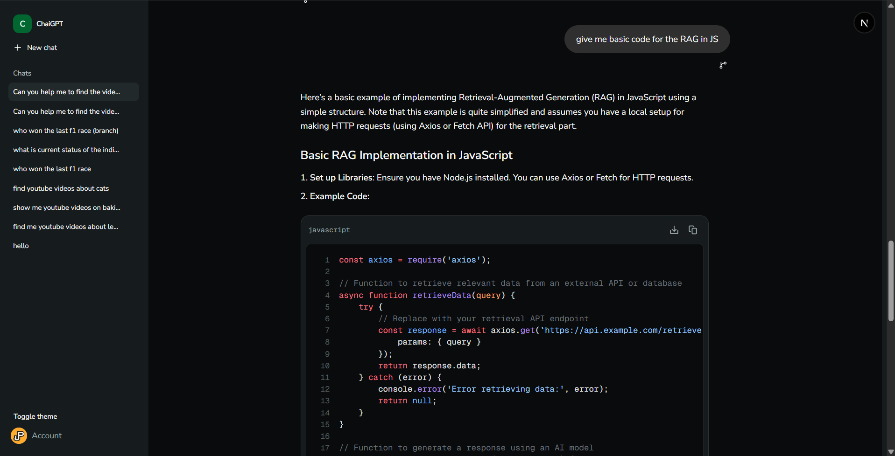
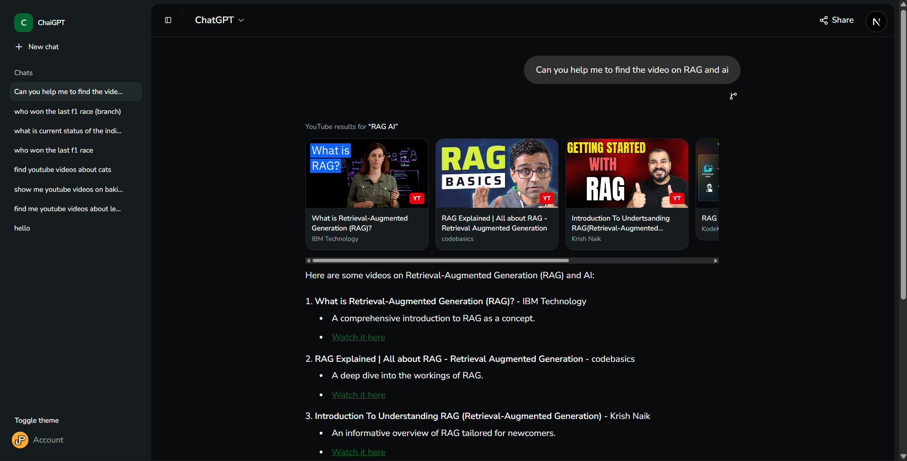
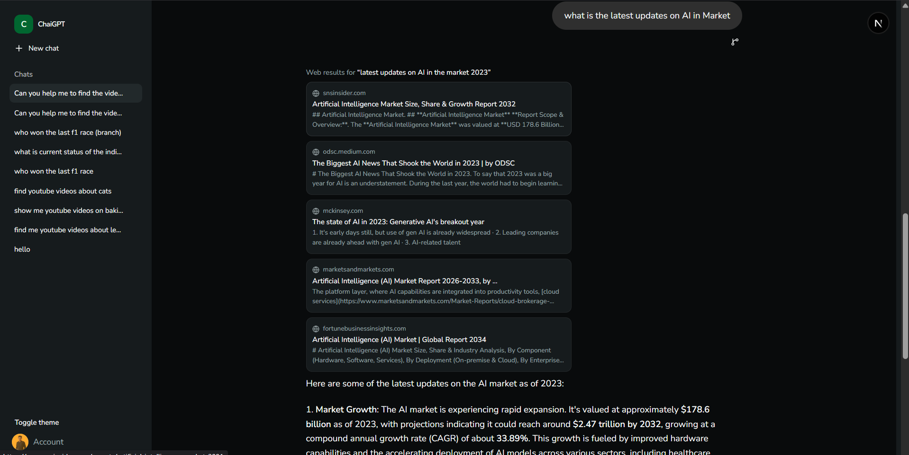

# ChaiGPT

A ChatGPT-style chat app built on Next.js, with streaming AI responses, tool calling (YouTube + web search), and conversation branching.

## Stack

- **Next.js** (App Router) + React + TypeScript
- **AI SDK** (`ai@7`) + `@ai-sdk/react` for streaming chat and tool calling
- **Prisma** + PostgreSQL (Neon) for persistence
- **Clerk** for authentication
- **Tailwind CSS** + shadcn/ui (Base UI primitives) for the interface
- **Tavily API** for web search, **YouTube Data API v3** for video search

## Features

### Streaming chat
Real-time token streaming via the AI SDK, with distinct loading states — "Thinking…", "Searching YouTube…", "Searching the web…" — instead of a single opaque spinner, so the user can see what the model is doing at each step.



### YouTube search tool
The model decides on its own when to call `searchYouTube` (`features/ai/tools/youtube.ts`) — e.g. when asked to find or recommend videos. Results render as clickable video cards with thumbnail, title, and channel.



### Web search tool
Toggle "Web search" in the composer (off by default) to let the model call `searchWeb` (`features/ai/tools/web-search.ts`, backed by Tavily) for current or real-world information. Sources render as a list of cards with domain, title, and snippet; the model cites them in its answer.



### Conversation branching
Hover any message and click the branch icon to fork the conversation from that exact point — the new branch keeps full history up to the branch point but continues independently. Switch between branches from the header dropdown; rename/delete/pin work the same as any other chat via the sidebar.


## Architecture notes

- **Tool calls are persisted, not just displayed.** Every `UIMessage` (including tool-call and tool-result parts) is stored as-is in `Message.parts` (JSON) in Postgres, so reloading a conversation replays tool results exactly as they streamed — see `features/ai/actions/chat-store.ts`.
- **Branching is modeled as conversations, not message trees.** Creating a branch copies messages up to the split point into a new `Conversation` row linked via `rootConversationId` / `parentConversationId` / `branchFromMessageId` (`prisma/schema.prisma`). This means branches get rename/delete/pin for free by reusing the existing conversation actions.
- **Tool availability is request-scoped.** `webSearchEnabled` is sent per-request from the composer toggle; the API route (`app/api/chat/route.ts`) only registers the `searchWeb` tool when it's on, so the model can't reach for it unless the user opted in.

## Getting started

```bash
npm install
npx prisma migrate dev
npm run dev
```

Required environment variables (`.env`):

```
DATABASE_URL=            # Postgres connection string
NEXT_PUBLIC_CLERK_PUBLISHABLE_KEY=
CLERK_SECRET_KEY=
YT_API_KEY=               # YouTube Data API v3 key
Tavily_API_KEY=           # Tavily Search API key
```

Open [http://localhost:3000](http://localhost:3000).
